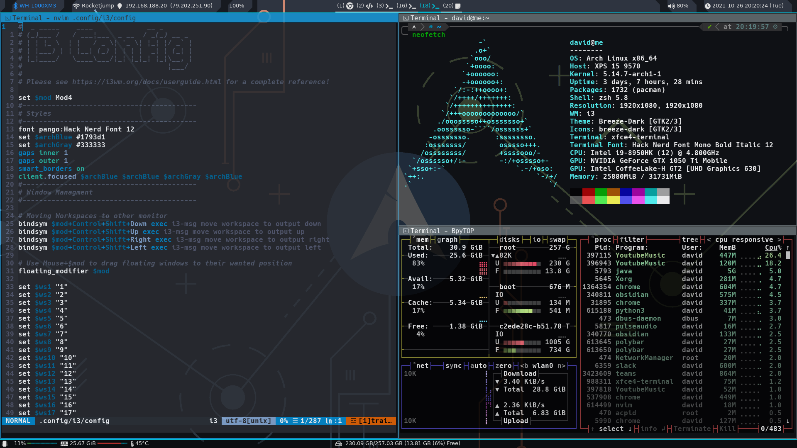

# dotfiles
The dotfiles used for my Arch Setup.

# Software

| Type                  | Used Software                |
|-----------------------|------------------------------|
| Operating System (OS) | Arch Linux                   |
| Display-Manager       | Xorg                         |
| Window Manager (WM)   | i3 + i3-gaps                 |
| Terminal              | Xfce4-Terminal                |
| Shell                 | ZSH (with Oh-My-ZSH, p10k)   |
| Application Runner    | Rofi                         |
| Notification          | Dunst                        |
| File Manager          | Ranger/broot/pcmanfm/spacefm |
| PDF-Viewer            | Evince, zathura              |
| Bar                   | Polybar                      |

